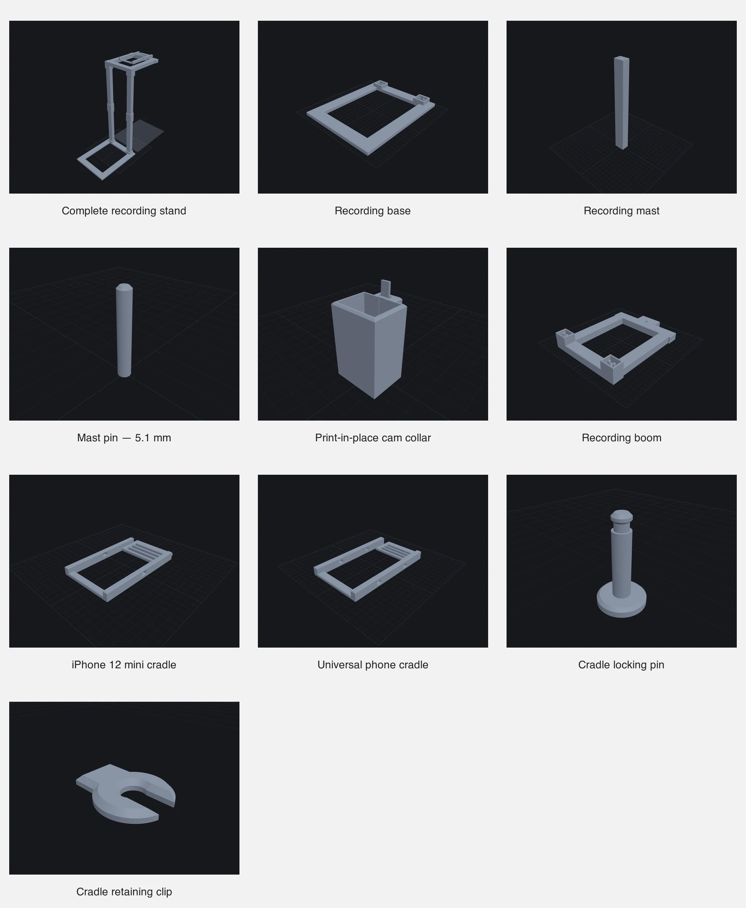

# reMarkable overhead phone recording stand



A modular, fully 3D-printable tower that holds a phone above a portrait reMarkable 2 for recording handwriting and demonstrations. The tablet's left and right edges remain open, so the stand does not favour either writing hand.

The original conversational brief is preserved in [`SEED.md`](SEED.md). It explains why the stand is overhead, portrait-oriented and deliberately open on both writing sides.

## Project story

- [Read the design story](https://freshteapot.net/writing/designing-a-remarkable-recording-stand/)
- [Watch the build video on YouTube](https://youtube.com/shorts/me6PZGDw2Dk?feature=share)

> [!WARNING]
> This is a work in progress and the unballasted stand is top-heavy. **Do not place a phone overhead without substantial ballast across the rear of the base.** Keep the tablet and anything fragile out from underneath during initial testing. A heavy book is currently part of the operating setup.

## Current status

Physically printed and tested:

- Four mast segments
- 5.1 mm removable mast pins
- The 24.2 x 18.2 mm socket and its integral 5.2 mm dowels
- Print-in-place cam collar and its quarter-turn clamp
- 16 mm recording boom

Still awaiting complete-system validation:

- Finished base under full assembled load
- Phone retention while inverted and overhead
- Long recording sessions and vibration behaviour
- Formal tip/stability testing

Treat this release as an experimental build, inspect every printed part, and use it at your own risk.

## Printed parts

| File | Quantity | Purpose |
| --- | ---: | --- |
| `recording_base.stl` | 1 | Freestanding footprint; requires external ballast |
| `recording_mast.stl` | 4 | Two stacked segments per tower column |
| `mast_pin.stl` | 4 | 5.1 x 34 mm alignment pins for the two mast joints |
| `mast_cam_collar.stl` | 2 | Clamps around the two mid-column joints |
| `recording_boom.stl` | 1 | Twin-rail overhead frame |
| `iphone_12_mini_cradle.stl` | 1 | Fitted cradle for the original cased iPhone 12 mini |
| `phone_cradle.stl` | 1 optional | Universal alternative; print one cradle type, not both |
| `cradle_lock_pin.stl` | 1 | Tool-free cradle-to-boom pin |
| `cradle_retaining_clip.stl` | 2 | One working clip plus a spare |

Ready-to-slice models are in [`stl/`](stl/). Parametric nurb sources and their design-history cards are in [`source/parts/`](source/parts/).

## Important fit dimensions

- Mast section: 24 x 18 mm
- Base and boom sockets: 24.2 x 18.2 mm
- Integral base/boom dowels: 5.2 mm
- Removable mast pins: **5.1 mm**, 34 mm long
- Mast socket holes: 5.4 mm in the CAD model
- Tower-column spacing: 130 mm
- Two stacked mast segments: approximately 440 mm
- Boom thickness: 16 mm

The 5.1 and 5.2 mm values are deliberately different. Do not scale the parts in the slicer to adjust fit.

## Printing

The stand was developed for an Anycubic Kobra S1 Combo with a 250 x 250 x 250 mm build volume. The base is 190 x 230 mm and the corrected boom is 160 x 210 mm.

| Part | Orientation | Supports |
| --- | --- | --- |
| Base | Flat, as supplied | None |
| Mast | Upright | None |
| Mast pin | Upright on its full-width flat end | None |
| Cam collar | Upright | None |
| Boom | Flat with socket collars and integral dowels upward | None |
| Either phone cradle | Flat, as supplied | None |
| Cradle locking pin | Upright | None |
| Retaining clip | Flat | None |

PETG is preferred for the retaining clips because they flex during installation. PLA should be suitable for occasional assembly, but discard any clip that shows a crack. Use a structural profile you trust for the larger load-bearing parts.

The repository deliberately excludes G-code. Generate it for your own printer, material and slicer profile.

## Assembly

1. Place the base on a level, non-slip surface. Put substantial ballast across both rear feet, behind the mast line.
2. Insert the non-tapered ends of two lower masts into the base sockets. The base's integral 5.2 mm dowels enter the mast holes.
3. Slide one cam collar onto each lower mast before joining the upper segments.
4. Place two 5.1 mm mast pins in each mid-column joint. Insert each pin's **tapered end into the non-tapered mast end**; its flat end enters the externally tapered mast end.
5. Join the upper masts, centre each cam collar over its seam, and rotate its tab approximately 90 degrees until the joint is held firmly.
6. Flip the printed boom for assembly so its collars face downward. Lower it onto both upper mast ends; its four integral 5.2 mm dowels enter the mast sockets.
7. Join the selected phone cradle to the front of the boom with the locking pin. Snap the C-clip sideways into the narrow groove at the pin tip.
8. Retain the phone with elastic bands appropriate to the selected cradle.
9. Test the cradle and phone over something soft before mounting them on the tower. Then perform a gentle tip test with the tablet removed.

## Releasing the print-in-place cam

Do not twist harder if the cam's finger tab visibly bends.

1. Support the empty collar in your hand.
2. Push the bottom of the cam gently upward with a blunt 2–3 mm rod or Allen key.
3. The two tiny print bridges should shear with a small click.
4. Reseat the cam and confirm that it rotates freely before placing it on a mast.

The cam's flat side is the unlocked position. Turning the round side toward the mast applies the clamp pressure.

## Source files

The source uses [nurb](https://nurb.dev/), where each part is a parameterised Python function.

```sh
cd source
nurb dev
```

The complete preview is `mobile_recording_stand`. Each `.md` card beside a part records physical test results, rejected experiments and dimensions that should not be casually changed.

## Licence

The design, source and printable files are licensed under the [CERN Open Hardware Licence Version 2 – Strongly Reciprocal](LICENSE.txt).
